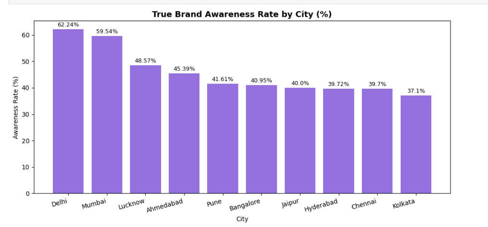
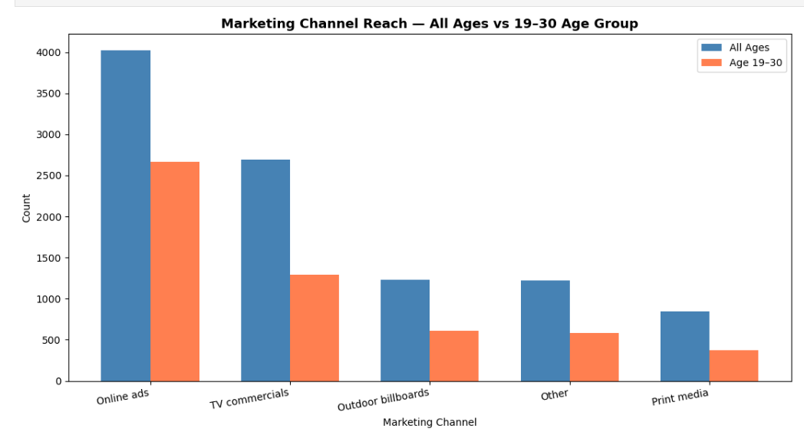
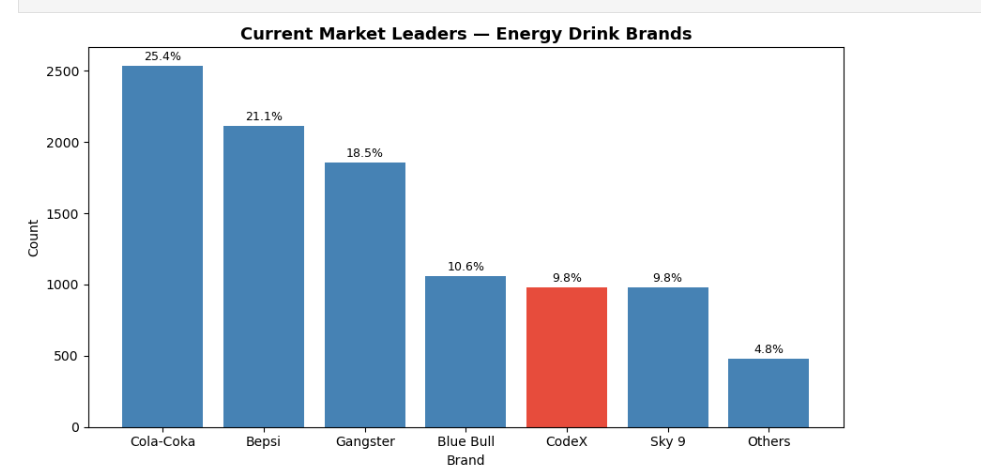
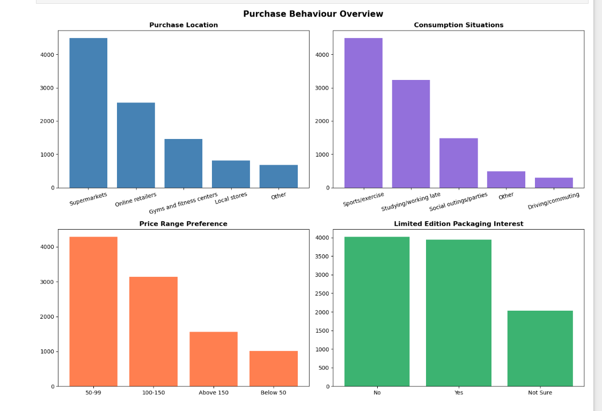

# 🥤 CodeX Beverage Market Analysis
### Python · Pandas · Matplotlib · NumPy






---

## 📌 Project Overview

CodeX is a German energy drink brand that recently launched in **10 Indian cities**.  
The marketing team collected survey data from **10,000 respondents** to understand consumer behaviour, brand perception, and competitive positioning.

**My role:** Analyse the survey data and deliver actionable insights to help CodeX grow market share, improve brand awareness, and guide product development decisions.

---

## 🎯 Business Questions Answered

| # | Question | Key Finding |
|---|---|---|
| 1 | Who is the core customer? | Males aged 19–30 → 55% of respondents |
| 2 | Where is CodeX best known? | Delhi (62.2%) and Mumbai (59.5%) lead |
| 3 | Why do people choose competitors? | Brand reputation (26.5%), taste (20.3%), availability (19%) |
| 4 | What product improvements do customers want? | Less sugar (29.9%), natural ingredients (25%) |
| 5 | Which marketing channel works best? | Online ads dominate — 48.3% among 19–30 age group |
| 6 | What ingredients do customers expect? | Caffeine (38.9%) and Vitamins (25.3%) |
| 7 | What packaging do people prefer? | Compact portable cans (39.8%) |
| 8 | Who are the market leaders? | Cola-Coka (25.4%) and Bepsi (21.1%) — CodeX at 9.8% |
| 9 | How is CodeX's brand perceived? | 59.7% neutral — a huge conversion opportunity |
| 10 | Where do people buy energy drinks? | Supermarkets (44.9%) and Online (25.5%) |
| 11 | What price range do customers prefer? | ₹50–99 preferred by 42.9% — CodeX priced too high |

---

## ⚠️ Key Data Integrity Finding

> During EDA, I identified that **5,119 respondents** who answered `Tried_before = No`  
> still had `Taste_experience` ratings recorded — a logical impossibility.  
> This was isolated and excluded from all taste-related analysis using a filtered dataset `df_tried`.  
> This is a classic example of data that looks clean (no nulls) but contains integrity issues.

---

## 📊 Dataset

| File | Rows | Description |
|---|---|---|
| `dim_respondents.csv` | 10,000 | Respondent demographics — Age, Gender, City |
| `dim_cities.csv` | 10 | City names and tier classification |
| `fact_survey_responses.csv` | 10,000 | 23 survey response columns |

**Source:** [Codebasics Resume Project Challenge 6](https://codebasics.io/challenge/codebasics-resume-project-challenge/9)

---

## 🚀 Final Recommendations for CodeX

**1. Product** — Launch a 'Natural Energy' variant with reduced sugar, Guarana-based caffeine, and 2–3 new flavors (mango, mint) to address the top 3 improvement demands.

**2. Pricing** — Introduce a smaller SKU at ₹89–99 targeting students. Current ₹150 price is outside the comfort zone of 74% of respondents.

**3. Marketing** — Run a 'Fuel Your Hustle' campaign on Instagram and YouTube targeting males 19–30. Sponsor marathons and college fests for physical brand touchpoints.

**4. Brand Ambassador** — Sign **Shubman Gill** as primary ambassador. Partner with fitness creators like Saket Gokhale and Daniel J Samuel for authentic digital engagement with the sports/exercise segment (44.9% of users).

**5. Distribution** — List on Blinkit, Zepto and Amazon immediately. Secure supermarket shelf space and place vending machines at gyms and college campuses.

---

## 🛠️ Tools & Skills Used

- **Python** — Core analysis language
- **Pandas** — Data loading, merging, filtering, aggregation
- **Matplotlib** — Bar charts, grouped charts, annotated visualisations
- **NumPy** — Grouped bar chart positioning
- **Jupyter Notebook** — Analysis environment
- **Data Integrity Thinking** — Identified logical data issues beyond null checks

---

## 📁 Project Structure

```
data_analysis_projects/
└── codex-beverage-market-analysis/
    ├── README.md
    ├── codex_market_analysis_final.ipynb
    ├── datasets/
    │   ├── dim_repondents.csv
    │   ├── dim_cities.csv
    │   └── fact_survey_responses.csv
    └── images/
        ├── purchase_behaviour.png
        ├── market_leaders.png
        ├── marketing_channels.png
        └── city_awareness.png
```

---

## 🔗 Connect

**LinkedIn:** [https://www.linkedin.com/in/dhaval-dupare-84879525a]  
**GitHub:** [https://github.com/Dhaval-DS/Data_Analysis_projects]

---

*Part of my Data Analyst portfolio | Codebasics Resume Project Challenge 6*
